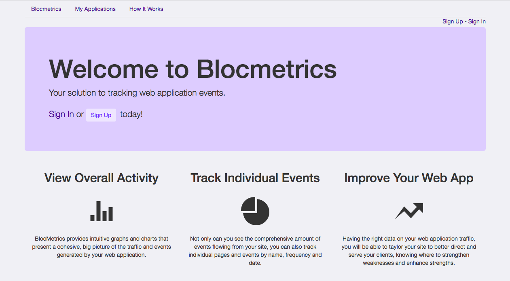

#BlockMetrics: an API tracking and reporting application



BlocMetrics is an API tracking and reporting application that lets you track the traffic to your registered web application. All you need to do is create an account [here](http://stark-caverns-21277.herokuapp.com/) and then register the name and URL of your web application. To start logging traffic to your site, add the following snippet to your application's code with your own "Event Name":

````
var blocmetrics = {};
blocmetrics.report = function(yourEventName) {
   var event = {event: { name: yourEventName }};
   var request = new XMLHttpRequest();
   request.open("POST", "http://stark-caverns-21277.herokuapp.com/api/events", true);
   request.setRequestHeader('Content-Type', 'application/json');
   request.send(JSON.stringify(event));
}

blocmetrics.report("Event Name");
````

You can register multiple URL's from your site, adding this snippet to each appropriate page. Additionally, you can change or use the same Event Name depending on how you want to track user interaction with your application.

Once the code is added and the website is registered, the events will start to be recorded and presented in easy-to-read, colorful graphs.


----
Created by Valorie with BLOC
